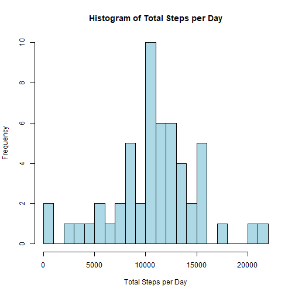
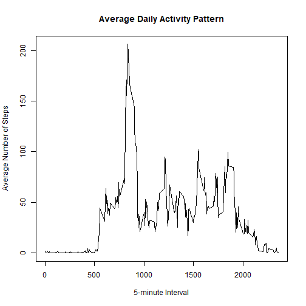
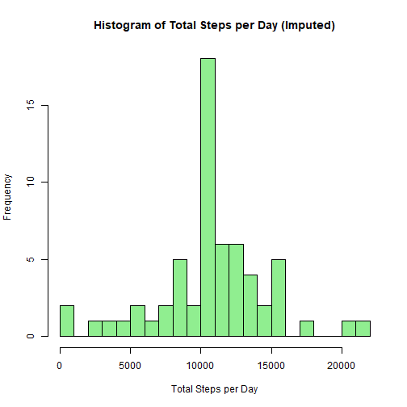
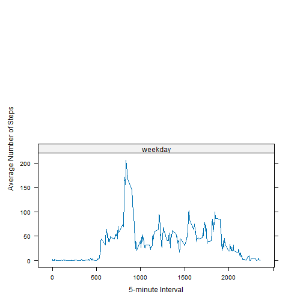

## Loading and preprocessing the data


``` r
library(ggplot2)
library(lattice)

data <- read.csv("activity.csv")
data$date <- as.Date(data$date)
str(data)
```

```
## 'data.frame':	17568 obs. of  3 variables:
##  $ steps   : int  NA NA NA NA NA NA NA NA NA NA ...
##  $ date    : Date, format: "2012-10-01" "2012-10-01" "2012-10-01" "2012-10-01" ...
##  $ interval: int  0 5 10 15 20 25 30 35 40 45 ...
```

## What is mean total number of steps taken per day?


``` r
steps_per_day <- aggregate(steps ~ date, data, sum, na.rm = TRUE)
head(steps_per_day)
```

```
##         date steps
## 1 2012-10-02   126
## 2 2012-10-03 11352
## 3 2012-10-04 12116
## 4 2012-10-05 13294
## 5 2012-10-06 15420
## 6 2012-10-07 11015
```


``` r
hist(steps_per_day$steps, breaks = 20,
     main = "Histogram of Total Steps per Day",
     xlab = "Total Steps per Day",
     col = "lightblue")
```




``` r
mean_steps <- mean(steps_per_day$steps)
median_steps <- median(steps_per_day$steps)
mean_steps
```

```
## [1] 10766.19
```

``` r
median_steps
```

```
## [1] 10765
```

## What is the average daily activity pattern?


``` r
avg_steps_interval <- aggregate(steps ~ interval, data, mean, na.rm = TRUE)

plot(avg_steps_interval$interval,
     avg_steps_interval$steps,
     type = "l",
     xlab = "5-minute Interval",
     ylab = "Average Number of Steps",
     main = "Average Daily Activity Pattern")
```




``` r
avg_steps_interval[which.max(avg_steps_interval$steps), ]
```

```
##     interval    steps
## 104      835 206.1698
```

## Imputing missing values


``` r
sum(is.na(data$steps))
```

```
## [1] 2304
```


``` r
data_imputed <- data
interval_means <- aggregate(steps ~ interval, data, mean, na.rm = TRUE)

na_idx <- is.na(data_imputed$steps)
data_imputed$steps[na_idx] <- interval_means$steps[
  match(data_imputed$interval[na_idx], interval_means$interval)
]

sum(is.na(data_imputed$steps))
```

```
## [1] 0
```


``` r
steps_per_day_imputed <- aggregate(steps ~ date, data_imputed, sum)

hist(steps_per_day_imputed$steps,
     breaks = 20,
     main = "Histogram of Total Steps per Day (Imputed)",
     xlab = "Total Steps per Day",
     col = "lightgreen")
```




``` r
mean(steps_per_day_imputed$steps)
```

```
## [1] 10766.19
```

``` r
median(steps_per_day_imputed$steps)
```

```
## [1] 10766.19
```

## Are there differences in activity patterns between weekdays and weekends?


``` r
data_imputed$day_type <- ifelse(
  weekdays(data_imputed$date) %in% c("Saturday", "Sunday"),
  "weekend", "weekday"
)
data_imputed$day_type <- factor(data_imputed$day_type)
```


``` r
avg_interval_daytype <- aggregate(
  steps ~ interval + day_type,
  data_imputed,
  mean
)

xyplot(steps ~ interval | day_type,
       data = avg_interval_daytype,
       type = "l",
       layout = c(1, 2),
       xlab = "5-minute Interval",
       ylab = "Average Number of Steps")
```


